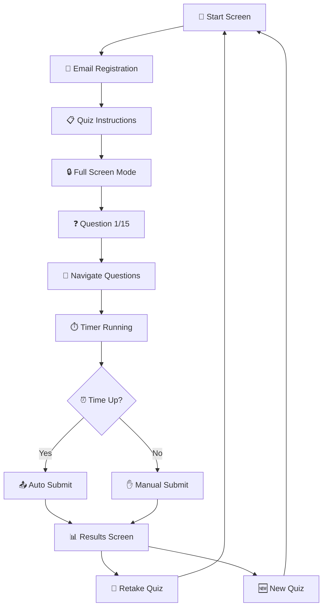

# FunnelQuiz - Smart Quiz Assessment Platform

<div align="center">


[](https://causalfunnelquiz.netlify.app/)
[](https://github.com/SURIYAPRASAAD04/FunnelQuiz)
[](https://drive.google.com/drive/folders/1IQX6zi-sM3tq_T2g5QGJ2psZij4fDcrH?usp=sharing)

**A modern, secure, and anti-malpractice quiz platform built for the digital age**

</div>

---

## Project Highlights

<table>
<tr>
<td width="33%" align="center">

<h3>Modern UI/UX</h3>
<p>Glassmorphism design with responsive layout</p>
</td>
<td width="33%" align="center">

<h3>Anti-Malpractice</h3>
<p>Full-screen mode with tab-switch detection</p>
</td>
<td width="33%" align="center">

<h3>Real-time</h3>
<p>Dynamic questions with live timer</p>
</td>
</tr>
</table>

---

## Quick Start

```bash
# Clone the repository
git clone https://github.com/SURIYAPRASAAD04/FunnelQuiz.git

# Navigate to project directory
cd FunnelQuiz

# Install dependencies
npm install

# Start development server
npm start

# Open http://localhost:3000 in your browser
```

---

## Features Showcase

<details>
<summary>🔍 <strong>Click to explore features</strong></summary>

### 🎯 **Core Features**
- ✅ **15 Dynamic MCQs** - Fresh Computer Science questions every time
- ⏱️ **Smart Timer** - 30-minute auto-submission with 2-min per question guide
- 🚫 **Malpractice Prevention** - Tab-switch, refresh, and full-screen exit detection
- 📱 **Mobile Responsive** - Seamless experience across all devices
- 🧭 **Free Navigation** - Jump between questions using side panel

### 🛡️ **Security Features**
- 🔒 Enforced full-screen mode during quiz
- 👁️ Tab visibility monitoring
- 🚨 Auto-submit on suspicious activity
- 🔄 Refresh/reload prevention

### 📊 **Results & Analytics**
- 📈 Detailed score breakdown
- 📋 Question-by-question review
- 📤 Share results functionality
- ⬇️ Download score report
- 🔁 Retake or start new quiz options

</details>

---

## Tech Stack

<div align="center">

| Frontend | Styling | API | Deployment |
|:--------:|:-------:|:---:|:----------:|
|  |  |  |  |

</div>

---

## Application Flow



---

## Screenshots

<div align="center">

### Start Screen


### Quiz Interface


### Results Dashboard


</div>

---

## Project Structure

```
FunnelQuiz/
├── 📁 src/
│   ├── 📄 App.jsx
│   ├── 📄 index.jsx
│   ├── 📄 Routes.jsx
│   ├── 📁 components/
│   │   └── 📁 ui/
│   ├── 📁 pages/
│   │   ├── 📁 quiz-start-screen/
│   │   ├── 📁 quiz-question-screen/
│   │   └── 📁 quiz-results-screen/
│   ├── 📁 services/
│   │   └── 📄 quizApiService.js
│   ├── 📁 styles/
│   │   └── 📄 tailwind.css
│   └── 📁 utils/
├── 📄 package.json
└── 📄 README.md
```

---

## Challenges Overcome

<table>
<tr>
<th>Challenge</th>
<th>Solution</th>
<th>Impact</th>
</tr>
<tr>
<td>Preventing Malpractice</td>
<td>Full-screen API + event listeners for tab switching, refresh attempts</td>
<td>Secure exam environment</td>
</tr>
<tr>
<td>Timer Management</td>
<td>JavaScript intervals with auto-submission triggers</td>
<td>Fair time enforcement</td>
</tr>
<tr>
<td>Mobile Responsiveness</td>
<td>Tailwind CSS utilities + separate mobile navigation</td>
<td>Cross-device compatibility</td>
</tr>
<tr>
<td>State Management</td>
<td>Centralized React hooks across components</td>
<td>Smooth user experience</td>
</tr>
</table>

---

## Developer

<div align="center">

### **Suriya Prasaad**

[](https://suriyaprasaad.netlify.app/)
[](https://www.linkedin.com/in/suriyaprasaad/)
[](mailto:suriyaprasaadjayasugumar04@gmail.com)

</div>

---

<div align="center">

### 🙏 **Thank you for checking out FunnelQuiz!**

If you found this project helpful, please consider giving it a ⭐

[](https://github.com/SURIYAPRASAAD04/FunnelQuiz/stargazers)
[](https://github.com/SURIYAPRASAAD04/FunnelQuiz/network/members)

---

**Made with ❤️ for CausalFunnel**

</div>
